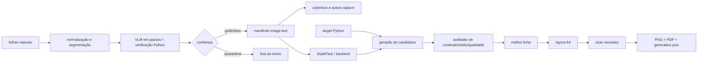

# Arquitetura

## Visão geral



## Módulos (`src/manual_handwrite/`)

| Módulo | Responsabilidade | Fase |
|---|---|---|
| `cli.py` | Entrada `handwrite`: `template`, `ingest`, `train`, `write`, `scanify` | 0+ |
| `scan_effect/` | Pipeline de degradação puro (numpy in, numpy out), determinístico por `seed` | 1 |
| `ingest/` | Normaliza páginas e segmenta linhas por projeção horizontal, sem rede | 1 |
| `data/` | Contratos de página, região, tiers de confiança e manifesto JSONL | 1 |
| `coverage/` | Mede tokens/operadores observados e seleciona captura adaptativa | 1 |
| `layout/` | Geometria A4, wrapping medido, indentação e quebras de página | 1 |
| `export.py` | PNG/PDF com metadado obrigatório do gerador | 1 |
| `template.py` | Gera a folha-modelo PDF com marcadores ArUco e grade de calibração | 2 |
| `ingest/` (extensão) | Detecta marcadores, corrige perspectiva, binariza (Sauvola), recorta células, rotula pela posição | 2 |
| `dataset.py` | Contrato do dataset: `index.jsonl` com `{char, variant, path, baseline, advance}` | 2 |
| `safety.py` | Recusa de assinatura, checagem de `owner_consent` | 2 |
| `style/glyphs.py` | v1: `GlyphBank` escolhe variantes, aplica ligaduras e jitter | 3 |
| `compose.py` | Layout: quebra de linha, margens, pauta, parágrafo | 3 |
| `export.py` | PNG/PDF 300 dpi com metadados obrigatórios | 3 |
| `style/neural.py` | v2: adaptador para modelo few-shot (extra `[neural]`) | 5 |

## Contratos principais

```python
# scan_effect
def scanify(page: np.ndarray, preset: str | ScanParams, seed: int) -> np.ndarray: ...


# style
class Style(Protocol):
    def render_word(self, text: str, rng: np.random.Generator) -> np.ndarray: ...  # RGBA


# compose
def compose_page(text: str, style: Style, page: PageSpec, seed: int) -> np.ndarray: ...
```

## Fronteiras de confiança

- `samples/`, `dataset/`, `styles/`, `models/`, `output/` são **dados pessoais**:
  ignorados pelo git e nunca lidos em CI.
- Nenhum módulo do núcleo faz rede. O extra `[neural]` só baixa pesos base
  públicos via comando explícito (`handwrite model download`).
