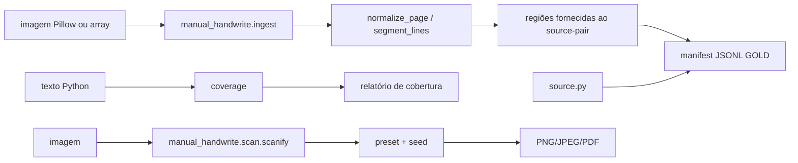

# Arquitetura

## Estado atual

O repositório contém um núcleo offline de contratos, pré-processamento,
cobertura e simulação de scan. Ele ainda **não** contém um renderizador de
manuscrito personalizado. A arquitetura abaixo separa o que existe hoje do
que continua sendo desenho futuro.

## Fluxo implementado



`scanify` e os contratos de ingestão não fazem rede. A validação de respostas
VLM em `transcribe/vlm_schema.py` também é apenas local: ela valida o JSON e a
proveniência, mas não chama um provedor nem implementa um adaptador de VLM.

## Módulos existentes (`src/manual_handwrite/`)

| Módulo | Responsabilidade atual | Estado |
|---|---|---|
| `cli.py` | CLI `handwrite` com `scanify`, `coverage` e `source-pair` | implementado |
| `scan/` | Simulação determinística de aparência escaneada usando Pillow e `random.Random` | implementado |
| `ingest/` | Orientação EXIF, conversão para tons de cinza e segmentação horizontal em `LineRegion` | implementado |
| `data/` | `PageMetadata`, `LineRegion`, `ManifestEntry`, tiers Gold/Silver/Quarantine e JSONL | implementado |
| `data/source_pair.py` | Ingestão local de par imagem + `source.py`, com consentimento, hash e regiões/textos fornecidos | implementado |
| `coverage/` | Contagem de caracteres, tokens e operadores Python e seleção gulosa de snippets | implementado |
| `style/` | `StylePack`/manifesto, referências relativas, hash, cobertura e `owner_consent`; extração conservadora de glifos em `glyphs.py` | implementado como contrato/extração, não como renderizador |
| `layout/` | `PageSpec`, wrapping medido e posicionamento de linhas em páginas A4 | implementado como primitivas, não como composição final |
| `export.py` | Exportação PNG/PDF com `generator=manual-handwrite-ia` | implementado |
| `evaluation/` | Distância de edição, taxa de erro de caracteres e acurácia de tokens críticos; estilo/qualidade ficam indisponíveis | implementado |
| `generation/` | Contrato de backend e `UnavailableBackend`; recusa renderização quando não há backend real | implementado como fronteira segura |
| `transcribe/vlm_schema.py` | Schema local para os quatro passes de uma resposta VLM | implementado como validação, sem integração de modelo |
| `reporting/` | Relatórios JSON/HTML de cobertura e confiança | implementado |
| `experiments/` | Infraestrutura de benchmark/experimentos, sem modelo de geração | implementado como suporte |

## O que não está implementado

Os nomes abaixo são arquitetura futura, não caminhos presentes nem APIs
utilizáveis hoje:

- `template.py`: geração de folha-modelo com marcadores, grade e variantes;
- uma extensão de ingestão para detectar ArUco, corrigir perspectiva,
  binarizar células e rotular automaticamente;
- `dataset.py`: contrato separado de dataset de glifos com `char`, `variant`,
  `baseline` e `advance`;
- `safety.py`: módulo separado para política de consentimento — hoje as
  validações relevantes estão em `data/source_pair.py` e `style/stylepack.py`;
- `compose.py` e `compose_page`: composição/renderização de manuscrito — hoje
  `layout` só posiciona texto e `generation` não produz pixels;
- `Style.render_word`: não existe. `Style`/`render_word` não são contratos
  atuais;
- `style/neural.py`: adaptador neural futuro, dependente do extra opcional;
- um backend `GlyphBank` que gere páginas; `style/glyphs.py` hoje faz apenas
  extração conservadora de glifos críticos;
- ingestão que invoque OCR/VLM, treinamento, captura ativa integrada à câmera
  ou geração personalizada.

## Contratos atuais relevantes

```python
from manual_handwrite.scan import scanify

result = scanify(pillow_image, seed=7, preset="foto-celular")
```

`scanify` recebe uma imagem Pillow (também aceita array NumPy na fronteira),
retorna o mesmo tipo de representação, não altera a entrada e oferece os
presets `scanner-escritorio`, `foto-celular`, `xerox-velho` e `limpo`.
A implementação do scan usa Pillow e `random.Random`; não usa OpenCV nem
`np.random.default_rng`.

As primitivas de layout são `PageSpec`, `wrap_text` e `layout_text` em
[`src/manual_handwrite/layout/__init__.py`](../src/manual_handwrite/layout/__init__.py).
A exportação está em
[`src/manual_handwrite/export.py`](../src/manual_handwrite/export.py).

## Fronteiras de confiança e privacidade

- `samples/`, `dataset/`, `styles/`, `models/` e `output/` são dados pessoais;
  não entram no git nem em CI.
- Consentimento do proprietário é obrigatório para `source-pair` e `StylePack`;
  marcadores de assinatura são recusados.
- O caminho padrão é offline. Nenhum módulo do núcleo baixa pesos ou envia
  imagens; integrações futuras devem exigir comando/flag explícito.
- Arquivos exportados preservam `generator=manual-handwrite-ia` no PNG e no
  Producer do PDF.

Para o estado operacional, consulte [`PROJECT-STATE.md`](PROJECT-STATE.md) e,
para as fases planejadas, [`IMPLEMENTATION-PLAN.md`](IMPLEMENTATION-PLAN.md).
