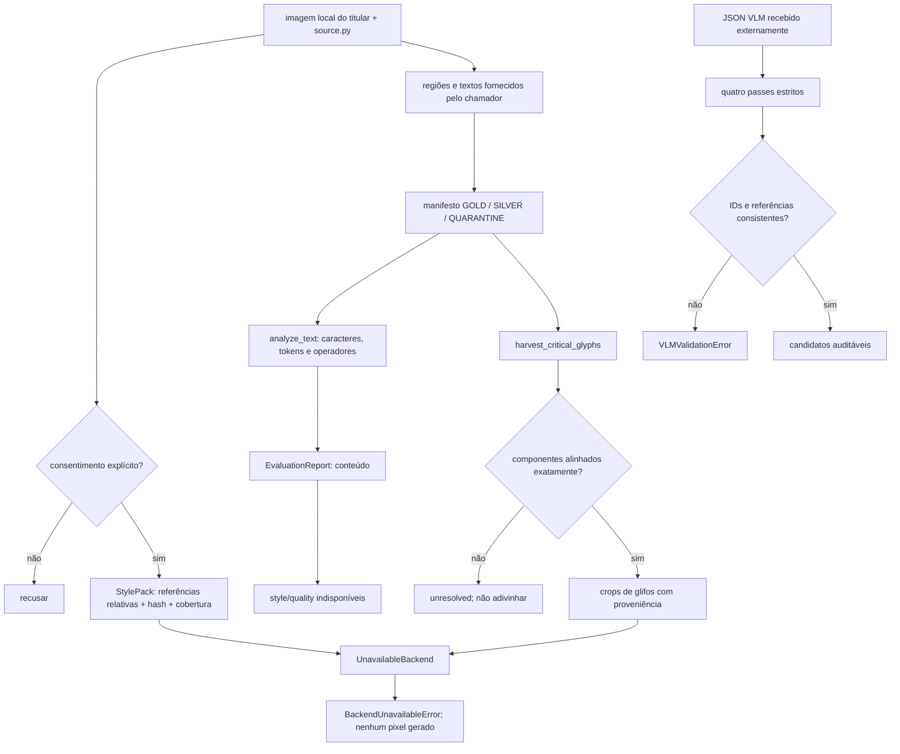

# 05 — O checkpoint real de personalização

Este é o ponto em que o projeto consegue **descrever e proteger** um estilo,
extrair evidência pequena de glifos e medir o conteúdo de uma transcrição. Ele
**ainda não gera uma página na letra do usuário**. O checkpoint não é um modelo
treinado: é a fronteira verificável entre dados consentidos, evidência auditável
e um backend que ainda não existe.

## Estado atual verificável

As seções abaixo descrevem somente contratos e testes presentes no repositório.
Passar os testes confirma comportamento local com fixtures; não transforma o
checkpoint em um sistema de geração nem em uma validação de letra real.

## O que entra e o que não entra

O estilo permitido é o estilo do próprio titular. Um `StylePack` é um manifesto
JSON de metadados; não carrega bytes de imagens nem abre os arquivos apontados.
A implementação está em [`src/manual_handwrite/style/stylepack.py`](../../src/manual_handwrite/style/stylepack.py),
com reexportes de compatibilidade em
[`src/manual_handwrite/style/manifest.py`](../../src/manual_handwrite/style/manifest.py)
e [`src/manual_handwrite/style/__init__.py`](../../src/manual_handwrite/style/__init__.py).

A forma real do manifesto é:

```json
{
  "version": "1.0",
  "owner_consent": true,
  "references": [
    {"path": "samples/owner/a.png", "provenance": {"source": "fixture"}}
  ],
  "dataset": {"id": "owner-dataset", "hash": "sha256:..."},
  "coverage": {"characters": 42, "tokens": 12, "operators": 9},
  "scan_preset": "scanner-escritorio"
}
```

O carregador falha fechado se `owner_consent` não for exatamente `true`, se não
houver referências, ou se os IDs/hash, cobertura, preset ou versão não forem
válidos. Referências devem ser relativas e não podem conter `..`, caminho
absoluto ou drive Windows. Marcadores de assinatura são recusados no manifesto.
Isso é uma barreira de autorização e proveniência; não prova que uma imagem
contém boa caligrafia.

Para uma página natural pareada com `source.py`, o caminho implementado é
[`src/manual_handwrite/data/source_pair.py`](../../src/manual_handwrite/data/source_pair.py):
`ingest_source_pair` exige consentimento, abre a imagem somente para dimensões,
valida a sintaxe Python e calcula o SHA-256 do `source.py`. As regiões e os
textos são fornecidos pelo chamador; esta função não faz OCR, VLM ou rede. Os
registros produzidos em `data/__init__.py` recebem confiança `1.0` e, portanto,
tier `gold`; `write_manifest` exclui `quarantine` por padrão. Veja também
[`src/manual_handwrite/data/__init__.py`](../../src/manual_handwrite/data/__init__.py).

## Colheita conservadora de glifos

[`src/manual_handwrite/style/glyphs.py`](../../src/manual_handwrite/style/glyphs.py)
implementa `harvest_critical_glyphs(image, transcription, threshold=200)`. A
imagem vira escala de cinza, a projeção vertical encontra componentes de tinta
e os componentes são alinhados, em ordem, aos caracteres não brancos da
transcrição. Só são devolvidos candidatos para `CRITICAL_GLYPHS` — operadores e
pontuação Python como `+`, `=`, `(`, `)`, `:`, `[]`, `{}` e aspas. Cada candidato
retém `symbol`, crop, `bbox` e `GlyphProvenance` (texto original, índice,
bounding box e `vertical_projection`).

O detalhe importante é a recusa: se a imagem estiver vazia ou o número de
componentes não for exatamente o número de caracteres não brancos, o resultado
não escolhe um glifo por aproximação. Retorna `unresolved`, por exemplo
`blank_image` ou `component_count_mismatch`, e nenhum candidato. A segmentação
é deliberadamente simples: junções cursivas, pontos ou marcas tocando podem
causar recusa. Isto é evidência para uma futura `GlyphBank`, não uma
`GlyphBank` pronta e não uma inferência de glifo ausente.

## Avaliação que existe

[`src/manual_handwrite/evaluation/metrics.py`](../../src/manual_handwrite/evaluation/metrics.py)
compara texto literal, sem normalização Unicode, limpeza de espaços ou correção
ortográfica:

- `normalized_character_error_rate`: distância de Levenshtein dividida pelo
tamanho do texto de referência; retorna `None` quando a referência é vazia.
- `critical_token_accuracy`: extrai tokens Python e calcula a proporção de
coincidências na maior subsequência comum dos tokens críticos, considerando
inserções e omissões.

[`src/manual_handwrite/evaluation/report.py`](../../src/manual_handwrite/evaluation/report.py)
produz `EvaluationReport` com os dois textos sem alteração, métricas e
proveniência. Os campos `unavailable_metrics` são, por padrão, `("style",
"quality")`. Portanto, o checkpoint pode dizer se o conteúdo transcrito
coincide; não pode dizer que a letra parece a do usuário. Não há métrica,
benchmark, preferência em teste cego ou imagem personalizada implementada
nesta etapa.

## Contrato VLM sem backend VLM

O esquema local em
[`src/manual_handwrite/transcribe/vlm_schema.py`](../../src/manual_handwrite/transcribe/vlm_schema.py)
valida JSON já recebido; ele não chama fornecedor, lê imagem ou faz rede. O
protocolo tem exatamente quatro passes, nesta ordem:

1. `page_structure`: `{page_id, blocks}`; blocos têm `{block_id, lines}`,
linhas `{line_id, regions}` e regiões `{region_id, bbox}`.
2. `line_candidates`: `{lines}` com `{line_id, candidates}`; cada candidato
é `{candidate_id, text, confidence}` e a confiança fica em `[0, 1]`.
3. `reconciliation`: `{lines}` com `{line_id, selected_candidate_id,
alternatives}`.
4. `ambiguity_resolution`: `{lines}` com `{line_id, resolution, alternatives}`.

Objetos têm chaves estritas: campos desconhecidos, campos faltantes, arrays
vazios onde não são permitidos, IDs duplicados, bbox sem largura/altura
positiva, confiança inválida, JSON duplicado ou constantes não padrão são
recusados com `VLMValidationError`. `parse_vlm_pass` conserva `model` e
`prompt` como proveniência. `parse_vlm_protocol` exige os quatro passes, a
mesma coleção de `line_id` em todos eles e referências de candidatos válidas
na reconciliação. A validação não transforma uma hipótese VLM em verdade: o
texto ainda precisa de evidência e revisão do pipeline de dados.

O adaptador executável atual é apenas
[`src/manual_handwrite/transcribe/__init__.py`](../../src/manual_handwrite/transcribe/__init__.py):
`SuppliedTextTranscriber` empacota texto fornecido pelo chamador e marca
`visual_transcription: not-performed` e `network: not-called`, com status
`supplied_text`. Não existe adaptador que transcreva a fotografia.

## Backend de geração indisponível

[`src/manual_handwrite/generation/__init__.py`](../../src/manual_handwrite/generation/__init__.py)
define `HandwritingBackend`, `BackendCapabilities`, `Candidate` e
`BackendUnavailableError`. `UnavailableBackend` declara explicitamente:

```text
name=unavailable, version=0
available=False
supports_seed=True, supports_count=True, supports_stylepack=True
renders_handwriting=False, requires_network=False, requires_neural=False
```

Ele valida `text`, `StylePack`, `seed` inteiro e `count` inteiro positivo, mas
sempre lança `BackendUnavailableError` com a mensagem
`handwriting generation backend is unavailable; no text was rendered`. Não há
fallback para fonte do sistema. `Candidate` é apenas identidade/metadado
(`text`, `seed`, `index`, `backend`); não contém pixels e não deve ser descrito
como uma amostra manuscrita.

Assim, `train` e `write` citados em documentação de arquitetura/README são
intenção de fases futuras, não comandos disponíveis no `cli.py` atual. A CLI
real expõe `scanify` e `coverage`. O estado canônico em
[`docs/PROJECT-STATE.md`](../PROJECT-STATE.md) registra que ainda não houve
transcrição VLM executada nem geração de caligrafia personalizada.

## Fluxo do checkpoint



## Experimentos executáveis

Os experimentos usam somente fixtures sintéticas e não criam amostras pessoais.
Na raiz do repositório:

```bash
uv run pytest -q tests/test_stylepack.py tests/test_glyphs.py
```

Sucesso: os testes confirmam round-trip do manifesto, recusa de consentimento
não booleano, assinatura e path inseguro; confirmam colheita de `+`/`[]` com
proveniência e recusa de `component_count_mismatch`. Falha: qualquer teste
vermelho significa que essa barreira ou o alinhamento observado mudou; não
significa que um modelo aprendeu a letra.

```bash
uv run pytest -q tests/test_evaluation.py tests/test_vlm_schema.py tests/test_generation.py tests/test_transcribe.py
```

Sucesso: passam as métricas literais, a rejeição estrita dos quatro passes, a
proveniência `model`/`prompt`, os IDs cruzados e a recusa explícita do backend.
O teste de geração deve falhar se aparecer fallback de fonte ou se retornar
candidatos renderizados apesar de `available=False`. O teste de transcrição
passa somente para texto já fornecido e confirma que a transcrição visual foi
`not-performed`.

Para observar o contrato de cobertura sem dados externos:

```bash
uv run python -c "from manual_handwrite.coverage import analyze_text; print(analyze_text('if x >= 2:\\n    return x\\n').as_dict())"
```

Sucesso: o dicionário mostra contagens e listas determinísticas de ausências;
ausências não são preenchidas automaticamente. Para o gate completo do
projeto, use `uv run pytest -q && uv run ruff check . && uv run ruff format
--check .`. Esse gate verifica contratos locais; não é evidência de que exista
um backend VLM ou de geração.

## Futuro condicionado, não estado atual

O próximo marco é implementar, separadamente, um backend local de renderização
que consuma um `StylePack` consentido, defina contrato de pixels/proveniência e
seja medido por experimento reproduzível. Isso depende de dataset do titular,
contrato aprovado e critérios de segurança; não é oferecido pelos comandos
atuais. `train` e `write` permanecem nomes de fases futuras.

## Critério honesto de passagem

Este checkpoint passa quando os contratos acima permanecem verdes: consentimento
explícito, caminhos/proveniência preservados, quarentena não elegível por
padrão, glifo só com alinhamento exato, métricas de conteúdo reproduzíveis,
protocolo VLM estrito e backend ausente declarado sem produzir saída. Ele falha
— corretamente — se alguém chamar uma ausência de transcrição de OCR, tratar
`Candidate` como imagem, relatar `style`/`quality` como medidos, inventar uma
cobertura, ou afirmar que `UnavailableBackend` personalizou a caligrafia.

Até lá, a personalização está documentada e protegida, não concluída. O
roadmap e as dependências estão em [`docs/ROADMAP.md`](../ROADMAP.md); o estado
canônico continua em [`docs/PROJECT-STATE.md`](../PROJECT-STATE.md).
